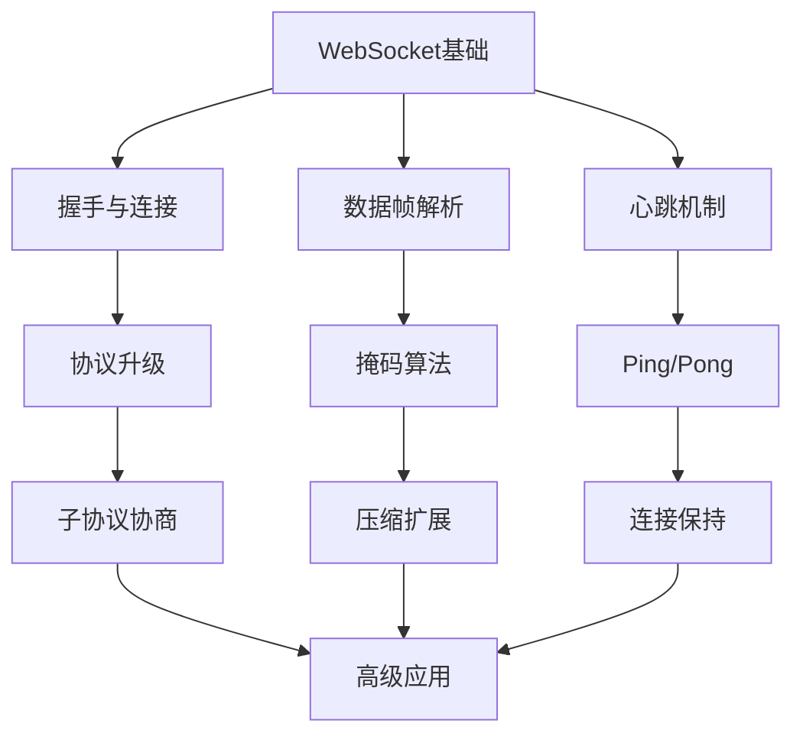
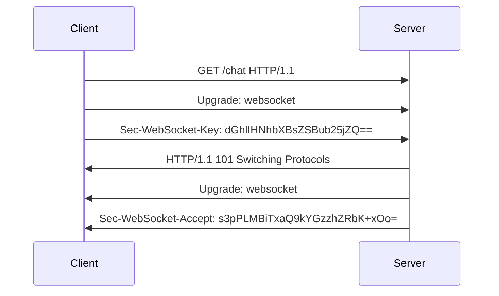
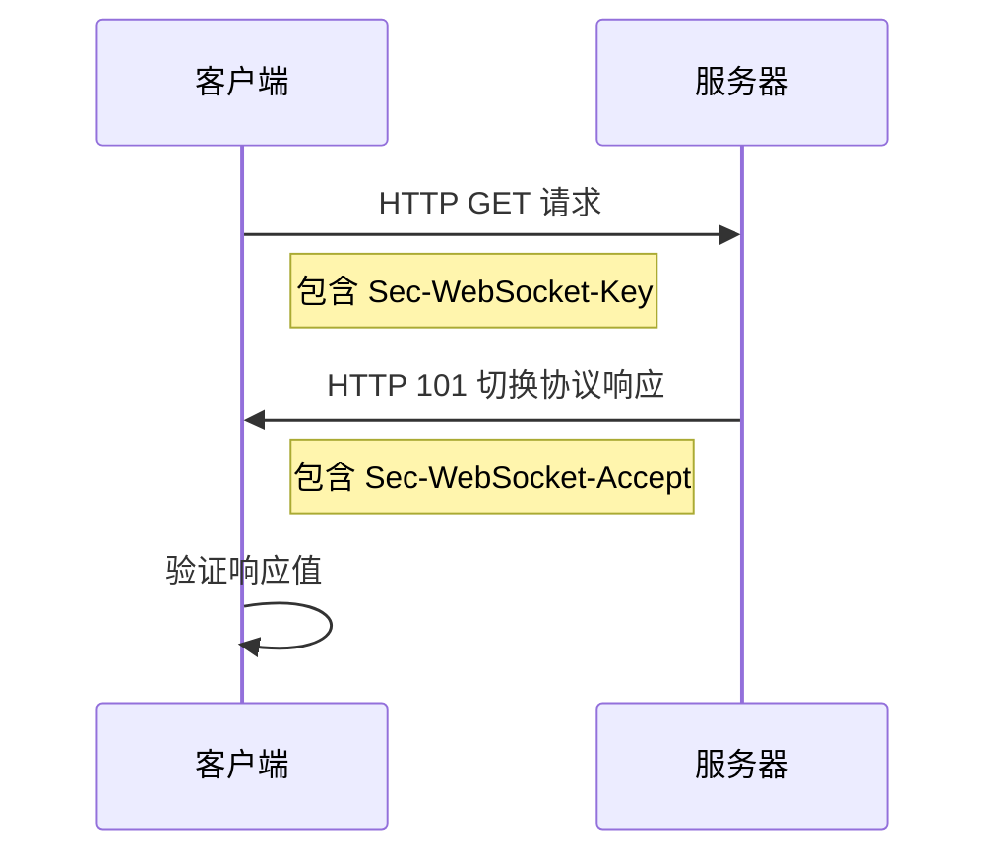
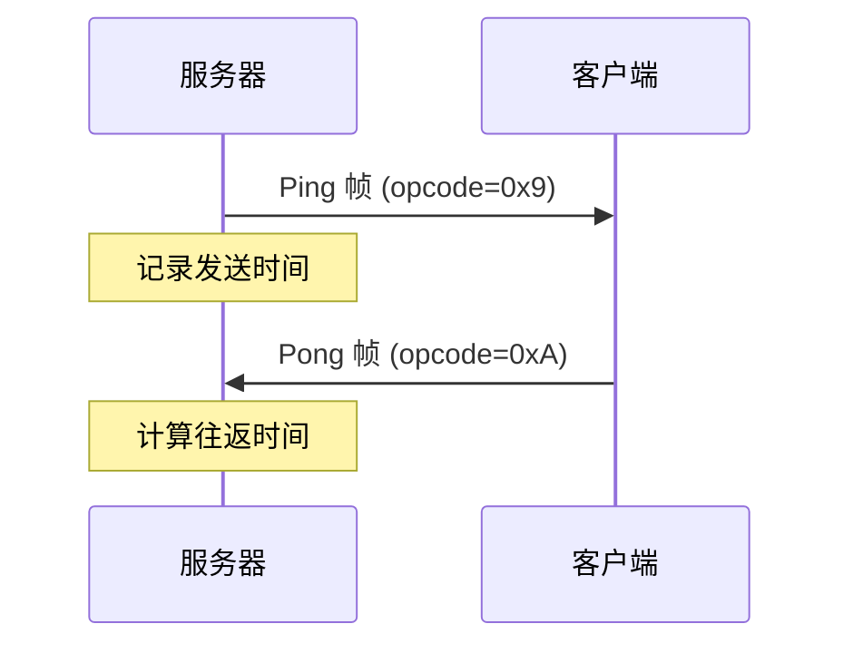
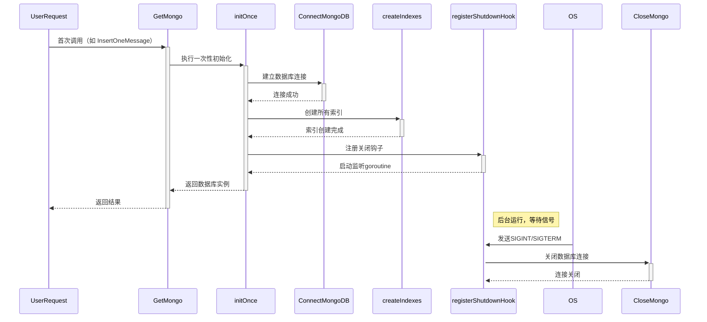
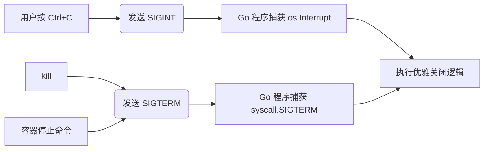
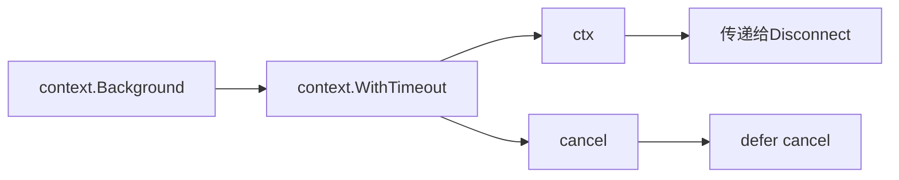
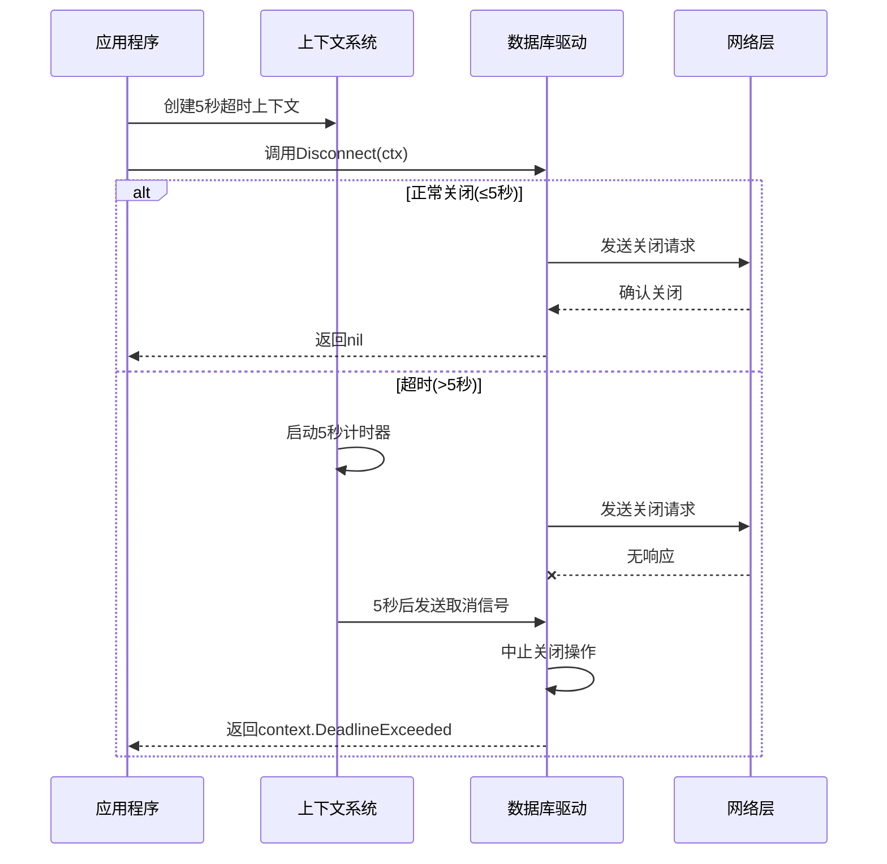
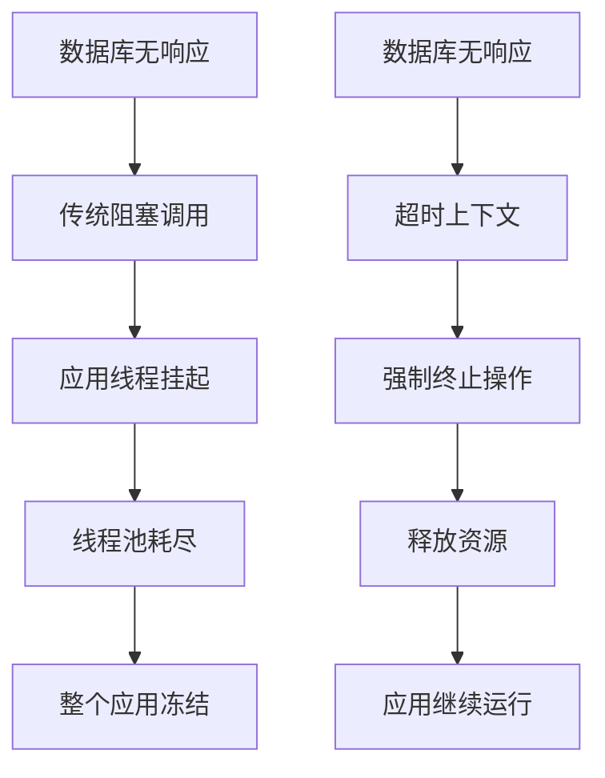
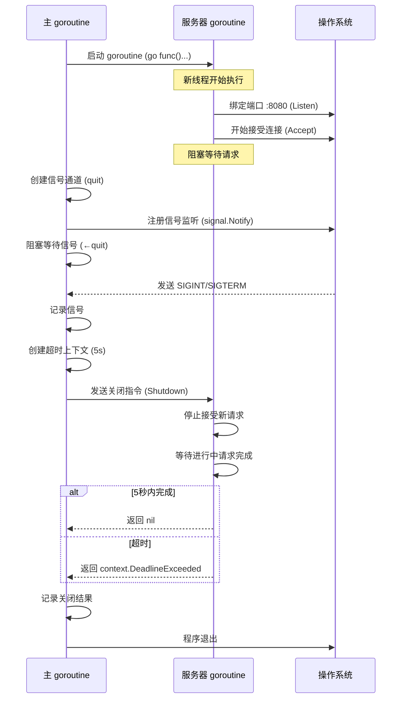

# GOIM

# IM系统的数据库技术选型

在本项目为敏捷开发，采用的数据库为Mongodb，所有数据都以document类型存储在mongo中

但是在实际应用中还是需要对数据库进行特别选型，以适应IM系统中数据快速增长的特殊要求

## IM系统的核心数据

1. 消息数据：海量、持续增长、强时效写入、按照会话/时间范围来读取
2. 联系人/好友关系数据：用户的好友列表、群组成员关系、关注关系。读取多、写入少，需要进行复杂的关联查询操作
3. 在线状态/会话数据：用户是否在线、最后活跃时间等。更新频繁，要求低延迟
4. 群组信息/频道信息：群组元数据（名称、公告、成员列表等）。读取多，写入相对较少
5. 用户资料：avatar, nickname, birthday等。读多写少

## 1. 消息存储

* 写入量巨大
* 按会话/按时间顺序高效查询
* 海量历史消息存储
* 低延迟读取

- **主流选项：**
  - **NoSQL (分布式键值/宽列/时序数据库):**
    - **Cassandra/ScyllaDB:** **非常主流的选择。**
      - **优势：** 高写入吞吐、线性水平扩展、分区容错、灵活的数据模型（宽列）、天然按分区键（如 `(sender_id, receiver_id)` 或 `(conversation_id)`）和时间戳排序存储，非常适合按会话和时间范围查询消息。运维相对成熟。
      - **劣势：** 最终一致性（可配置为强一致性但影响性能），二级索引效率相对较低（通常需要反范式设计或配合其他存储），学习曲线。
    - **HBase:** 类似 Cassandra，基于 HDFS，生态与 Hadoop 紧密。写入性能好，强一致性模型。但运维相对复杂，对 HDFS 有依赖。
    - **ScyllaDB:** Cassandra 的 C++ 高性能替代品，兼容 Cassandra API，性能（尤其是低延迟）和资源利用率更好，运维更简单。是 Cassandra 的有力竞争者。
    - **MongoDB:** **常用选择。**
      - **优势：** 灵活的文档模型（可直接存储复杂消息结构）、强大的查询能力（包括二级索引、聚合）、分片集群提供水平扩展、复制集保证高可用。开发友好。
      - **劣势：** 分片键选择非常关键（通常按 `conversation_id` 或 `user_id`），设计不当容易导致热点；默认内存映射引擎对内存要求较高；早期版本分片集群运维有一定复杂度（现在已改善）；写入吞吐极限可能不如 Cassandra/ScyllaDB 高。
  - **NewSQL (分布式关系数据库):**
    - **TiDB/CockroachDB/YugabyteDB:** 提供分布式、强一致性、兼容 SQL 的事务能力。
      - **优势：** 强一致性事务（对某些需要事务的消息逻辑很有用，如已读回执的原子更新）、熟悉的 SQL 接口、水平扩展、高可用。TiDB 在 HTAP 场景（混合负载）表现较好。
      - **劣势：** 相比 NoSQL，纯写入吞吐和低延迟可能略逊一筹（虽然也在不断优化）；运维复杂度通常高于成熟的 NoSQL 方案；成本可能更高（尤其涉及大量事务时）。**适用于对强事务有明确需求，且能接受相对略低峰值吞吐的场景。**
  - **关系数据库 (分库分表):**
    - **MySQL/PostgreSQL (分库分表):** 传统方案。
      - **优势：** 强一致性、成熟稳定、事务支持完善、生态丰富、开发者熟悉。
      - **劣势：** **扩展性瓶颈明显：** 分库分表（Sharding）带来极高的应用复杂度和运维成本（路由、扩容、数据均衡、分布式事务难）。单表/单库性能上限是硬伤，难以应对超大消息量。**通常只适合用户量、消息量预期非常有限（如企业内部IM）或作为其他存储的辅助（存储关系/元数据）。**
  - **专用时序数据库 (Time-Series DB):**
    - **InfluxDB/TimescaleDB:** 针对时间序列数据优化。
      - **优势：** 极高的时间戳相关写入和查询效率、强大的时间窗口聚合。
      - **劣势：** 数据模型（主要是数值+时间戳）不太契合IM消息的多样性（文本、图片、视频等富媒体元信息）；关系查询能力弱。**不推荐作为主消息存储，但可用于存储消息相关的衍生指标（如消息速率、在线状态变化）。**

## 2. 在线状态/会话数据

- **挑战：** 更新极其频繁（上下线、心跳）、要求极低延迟（毫秒级）、高并发读取。
- **主流选项：**
  - **内存数据库 (In-Memory DB):**
    - **Redis:** **绝对的主流和首选。**
      - **优势：** 内存操作带来微秒级读写延迟、丰富的数据结构（String, Hash, Set, Sorted Set, Bitmap 等都非常有用）、支持 Pub/Sub（可用于状态广播）、持久化选项（RDB/AOF）、集群模式提供高可用和扩展性。
      - **应用：** 存储用户当前在线状态、设备信息、活跃会话、最后活跃时间等。利用 Sorted Set 实现最近联系人/会话列表。
    - **Memcached:** 更简单纯粹的 KV 缓存。**优势：** 简单、高性能。**劣势：** 数据结构单一、无持久化（或弱）、无集群原生支持（需客户端分片）。在只需要简单 KV 且能容忍数据丢失的场景可用，但 **Redis 通常是更全面的选择**。
  - **etcd/ZooKeeper:** 强一致性的分布式协调服务。
    - **优势：** 强一致性、高可用、Watch 机制可用于状态变更通知。
    - **劣势：** 不是为高频状态存储设计，写入性能和容量有限。**适用于存储关键配置或少量核心元数据的状态（如主节点选举），不适合存储海量用户在线状态。**

## 3. 联系人/关系数据

- **挑战：** 关系复杂（好友、群组、关注、屏蔽）、需要高效查询（如共同好友、好友的好友）、读多写少。
- **主流选项：**
  - **图数据库 (Graph DB):**
    - **Neo4j/TigerGraph/Dgraph/JanusGraph:** **最适合表达和查询复杂关系的数据库。**
      - **优势：** 直观建模（用户为节点，关系为边）、高效执行深度关系遍历和复杂模式匹配查询（如 N 度好友、最短路径、共同群组）。
      - **劣势：** 写入吞吐通常不如 KV/文档数据库高；集群和运维复杂度相对较高；学习曲线较陡。**如果关系复杂度高且是核心业务（如社交IM），图数据库是非常有力的候选。**
  - **关系数据库 (RDBMS):**
    - **MySQL/PostgreSQL:** **最成熟通用的选择。**
      - **优势：** ACID 事务保证数据一致性（如加好友双方原子更新）、强大的 SQL 查询能力（JOIN, 子查询）、成熟稳定、生态完善。
      - **劣势：** 表达复杂关系（如多对多、层级）需要复杂的表设计和 JOIN，深度查询（如 N 度）效率低下；水平扩展困难（分库分表成本高）。**适用于关系模型相对简单或规模可控的场景。**
  - **NoSQL (文档/宽列):**
    - **MongoDB:** 可以将用户的关系列表（好友ID列表、群组ID列表）内嵌在用户文档中或使用引用。
      - **优势：** 灵活、水平扩展性好。
      - **劣势：** 复杂的关系查询（如共同好友）需要在应用层处理或通过反范式设计（效率可能不高），缺乏原生关系遍历能力。
    - **Cassandra/ScyllaDB:** 可以设计宽表存储关系（如 `user_relations` 表，分区键 user_id， 存储 relation_type -> target_user_id 的映射）。
      - **优势：** 高扩展、高可用。
      - **劣势：** 复杂的关系查询（反向查询、共同关系）困难，需要额外设计或辅助索引。

## 4. 群组信息/用户资料

- **挑战：** 结构相对固定、读多写少、需要事务支持（如修改群信息、增减成员）。
- **主流选项：**
  - **关系数据库 (RDBMS):**
    - **MySQL/PostgreSQL:** 
      - **优势：** 强一致性事务（确保群操作原子性）、丰富的查询能力（复杂条件过滤、聚合）、成熟的权限管理和数据完整性约束。表结构清晰。
      - **劣势：** 水平扩展仍是挑战，但这类数据通常增长较慢，单库或主从复制往往能满足需求。如果规模极大，可考虑分库分表或 NewSQL。
  - **NoSQL (文档数据库):**
    - **MongoDB:** 可以将群组的完整信息（包括成员列表）存储在一个文档中。
      - **优势：** 读写单文档性能好，模式灵活（方便增减字段）。
      - **劣势：** 跨文档事务（如原子地更新群信息和成员关系）在早期版本弱（现在支持多文档事务，但需评估性能和影响）；复杂查询可能不如 SQL 直观。

综上，目前的想法是：

* `message`：`ScyllaDB`
* 会话：`redis`
* 好友关系/群组信息/个人资料：`postgresql`

将会在这个IM系统的完全体重构中使用这些技术栈

为什么不在`typescript`的`v2`版本中重构...

`scylladb`的免费云有时间限制，我并不能保证我能在这点免费时间开发完成

而本地部署和`neo4j`, `tidb`这些图数据库和`newsql`一样需要部署`docker`环境

但我高考后用了五年的win本被我折腾到一打开`docker`就会卡顿，查下来是虚拟机环境冲突，但我也不想删除我的虚拟机...

臭白银就卡在这了

因此目前的想法是学习使用`postgresql`，配合`typescript`继续学习`websocket`原理

# Websocket原理





websocket是一种基于TCP的全双工通信协议，目的是为了解决HTTP协议只有在Client请求时才会从Server中回应的问题（即无法即时通信，在打游戏时Server端需要向Client端返回大量的敌人AI数据、服务器其他玩家数据等等）：

* HTTP协议是基于TCP的半双工通信，同一时刻Client和Server中只能有一个方向向对方传输数据
* HTTP是一种无状态的请求-响应型协议，每个请求都需要建立一个新的连接。服务器在每个响应之后会关闭连接，客户端需要重新建立发送新的请求
* HTTP支持持久连接，通过HTTP Keep-Alive头字段可以在一次连接中发送多个请求和响应
* 实现实时性的常用方法是轮询，但是效率较低，增加了一定量的网络负担

而**Websocket**协议：

* 全双工通信，客户端和服务器可以随时发送消息
* 基于单个TCP连接保持连接状态，避免每次通信都需要重新建立连接的开销
* 通过HTTP协议建立初始连接后Upgrade为Websocket协议（协议切换），可以由客户端或服务器发起关闭连接的请求
* 服务器或客户端可以通过事件触发实现及时的通信
* 适用于对实时性要求较高的应用，如online game or Instant Messaging

## 数据帧类型

```python
 0                   1                   2                   3
 0 1 2 3 4 5 6 7 8 9 0 1 2 3 4 5 6 7 8 9 0 1 2 3 4 5 6 7 8 9 0 1
+-+-+-+-+-------+-+-------------+-------------------------------+
|F|R|R|R| opcode|M| Payload len |    Extended payload length    |
|I|S|S|S|  (4)  |A|     (7)     |             (16/64)           |
|N|V|V|V|       |S|             |   (if payload len==126/127)   |
| |1|2|3|       |K|             |                               |
+-+-+-+-+-------+-+-------------+ - - - - - - - - - - - - - - - +
|     Extended payload length continued, if payload len == 127  |
+ - - - - - - - - - - - - - - - +-------------------------------+
|                               |Masking-key, if MASK set to 1  |
+-------------------------------+-------------------------------+
| Masking-key (continued)       |          Payload Data         |
+-------------------------------- - - - - - - - - - - - - - - - +
:                     Payload Data continued ...                :
+ - - - - - - - - - - - - - - - - - - - - - - - - - - - - - - - +
|                     Payload Data continued ...                |
+---------------------------------------------------------------+
```

* `FIN`: 是否为最终帧

* `RSV1-3`: 扩展操作码

* `opcode`: 操作码

  * 0x0: 连续帧。表示本次数据传输采用了数据分片，当前收到的数据帧是发送数据的其中一个数据分片
  * 0x1: 文本帧。使用文本格式表示数据
  * 0x2: 二进制帧。使用二进制表示数据
  * 0x8: 关闭连接
  * 0x9: Ping
  * 0xA: Pong

* `mask`:是否要对数据载荷进行掩码操作。当客户端向服务器端发送数据时，**必须**对数据进行掩码操作。服务器对客户端发送数据时不需要进行掩码操作。如果服务端接收到的客户端的数据没有进行过掩码操作，则会自动断开连接。

* `payload length`: 有效载荷的长度，单位是字节

  * **1.** **7位表示（0-125）：**

    如果payload的长度小于等于125，则payload长度字段使用7个比特（7位）直接表示

  * **2.** **16位表示（126）：**

    如果payload长度在126到65535之间，则payload长度字段使用126（二进制1111110）表示，后面跟着一个16位的无符号整数，用于表示实际的payload长度。

  * **3.** **64位表示（127）：**

    如果payload长度大于65535，则payload长度字段使用127（二进制1111111）表示，后面跟着一个64位的无符号整数，用于表示实际的payload长度

* `masking-key`: 加密或掩码数据载荷（payload）的密钥。0或4字节（因为`mask`为0时不需要进行掩码操作）

* `payload data`: 应用数据

## 握手与连接

在客户端与服务器建立持久连接之前，客户端通过http协议发送一个特殊请求，然后服务器通过http响应将协议升级为websocket，从而确立连接

1. 客户端发送握手请求。客户端（如浏览器）使用http协议发送一个特殊请求给服务器，该请求中包含一些特定的头部信息，如`Upgrade`和`Sec-WebSocket-Key`（16字节Base64编码随机字符串，用于服务器的验证）

```python
GET /chat HTTP/1.1
Host: server.example.com
Upgrade: websocket
Connection: Upgrade
Sec-WebSocket-Key: dGhlIHNhbXBsZSBub25jZQ==
Sec-WebSocket-Version: 13
```

2. 服务器发送握手响应。服务器同意建立websocket连接，发送一个http响应，响应中也包含一些特定的头部信息，如`Upgrade`（确认将协议升级为websocket）和`Sec-WebSocket--Accept`（根据客户端的`Sec-WebSocket-Key`计算出的验证码）

   1. 服务器计算响应值
      1. 拼接客户端密钥和GUID
      2. 计算SHA-1哈希值
      3. 对哈希结果进行64编码
   2. 服务器返回握手响应

   ```python
   HTTP/1.1 101 Switching Protocols
   Upgrade: websocket
   Connection: Upgrade
   Sec-WebSocket-Accept: s3pPLMBiTxaQ9kYGzzhZRbK+xOo=
   ```

   3. 客户端验证响应
      1. 客户端使用相同算法计算期望值
      2. 比较计算结果与服务器返回的`Sec-WebSocket--Accept`
      3. 匹配则建立websocket连接

```python
dGhlIHNhbXBsZSBub25jZQ==258EAFA5-E914-47DA-95CA-C5AB0DC85B11 # 拼接客户端密钥和GUID
```

握手成功后，客户端和服务器之间的连接就被升级为了WebSocket协议，之后双方可以通过该连接实现全双工通信



```python
import base64
import hashlib

def generate_accept(key: str) -> str:
    """计算Sec-WebSocket-Accept值"""
    GUID = "258EAFA5-E914-47DA-95CA-C5AB0DC85B11"
    combined = key.encode() + GUID.encode()
    sha1 = hashlib.sha1(combined).digest()
    return base64.b64encode(sha1).decode()

# 示例
client_key = "dGhlIHNhbXBsZSBub25jZQ=="
accept_key = generate_accept(client_key)
print(f"Sec-WebSocket-Accept: {accept_key}")  # 输出: s3pPLMBiTxaQ9kYGzzhZRbK+xOo=
```

GUID（全局唯一标识符）是一个[固定的魔法字符串](https://stackoverflow.com/questions/13456017/what-does-258eafa5-e914-47da-95ca-c5ab0dc85b11-means-in-websocket-protocol)：`"258EAFA5-E914-47DA-95CA-C5AB0DC85B11"`

1. **唯一性**：专门为 WebSocket 协议设计，确保不会与其他协议冲突
2. **固定值**：所有 WebSocket 实现必须使用这个相同的 GUID
3. **设计目的**：防止非 WebSocket 服务器意外接受连接
4. **长度**：36 个字符（32 个十六进制数字 + 4 个连字符）

## 数据帧解析

```python
                     0                   1                   2                   3
                     0 1 2 3 4 5 6 7 8 9 0 1 2 3 4 5 6 7 8 9 0 1 2 3 4 5 6 7 8 9 0 1
                    +-+-+-+-+-------+-+-------------+-------------------------------+
                    |F|R|R|R| opcode|M| Payload len |    Extended payload length    |
                    |I|S|S|S|  (4)  |A|     (7)     |             (16/64)           |
                    |N|V|V|V|       |S|             |   (if payload len==126/127)   |
                    | |1|2|3|       |K|             |                               |
                    +-+-+-+-+-------+-+-------------+ - - - - - - - - - - - - - - - +
                    |     Extended payload length continued, if payload len == 127  |
                    + - - - - - - - - - - - - - - - +-------------------------------+
                    |                               |Masking-key, if MASK set to 1  |
                    +-------------------------------+-------------------------------+
                    | Masking-key (continued)       |          Payload Data         |
                    +-------------------------------- - - - - - - - - - - - - - - - +
                    :                     Payload Data continued ...                :
                    + - - - - - - - - - - - - - - - - - - - - - - - - - - - - - - - +
                    |                     Payload Data continued ...                |
                    +---------------------------------------------------------------+
```

```python
import struct

def parse_frame(data: bytes):
    """解析WebSocket帧"""
    # 读取前两个字节
    byte1, byte2 = data[0], data[1]
    
    # 解析第一个字节
    fin = (byte1 & 0x80) >> 7
    opcode = byte1 & 0x0F
    
    # 解析第二个字节
    masked = (byte2 & 0x80) >> 7
    payload_len = byte2 & 0x7F
    
    # 处理扩展长度
    offset = 2
    if payload_len == 126:
        payload_len = struct.unpack('>H', data[offset:offset+2])[0]
        offset += 2
    elif payload_len == 127:
        payload_len = struct.unpack('>Q', data[offset:offset+8])[0]
        offset += 8
    
    # 读取掩码密钥
    mask_key = None
    if masked:
        mask_key = data[offset:offset+4]
        offset += 4
    
    # 读取有效载荷
    payload = data[offset:offset+payload_len]
    
    # 应用掩码
    if masked and mask_key:
        payload = apply_mask(payload, mask_key)
    
    return fin, opcode, payload

def apply_mask(payload: bytes, mask_key: bytes) -> bytes:
    """应用掩码到有效载荷"""
    unmasked = bytearray(payload)
    for i in range(len(unmasked)):
        unmasked[i] ^= mask_key[i % 4]
    return bytes(unmasked)
```

1. 使用`byte1=data[0]`解析第一个字节

   1. `fin = (byte1&0x80) >> 7 `取最高位作为FIN
   2. `RSV1-3`作为保留位用于协议扩展
   3. `opcode = byte1 & 0x0f`取低四位

2. 使用`byte2=data[1]`解析第二个字节

   1. `mask_bit = (byte2 & 0x80) >> 7`判断是否使用掩码
   2. 之后通过`byte2 & 0x7F`获取有效载荷长度。此时需要额外判断实际长度

   ```python
   offset = 2  # 当前读取位置
   
   if payload_len == 126:
       # 16位无符号整数
       payload_len = struct.unpack('>H', data[offset:offset+2])[0]
       offset += 2
   elif payload_len == 127:
       # 64位无符号整数
       payload_len = struct.unpack('>Q', data[offset:offset+8])[0]
       offset += 8
   ```

3. 判断是否需要存在`mask_bit`, 如果存在则需要读取掩码密钥（4位）

4. 读取有效载荷`payload = data[offset:offset+payload_len]`

5. 应用掩码

6. 根据`opcode`值，对特殊帧进行处理

```python
if opcode == 0x8:  # 关闭帧
    # 关闭帧可能包含关闭原因
    if len(payload) >= 2:
        close_code = struct.unpack('>H', payload[:2])[0]
        reason = payload[2:].decode('utf-8', 'ignore')
    else:
        close_code = 1005  # 无状态码
        reason = ""
        
elif opcode == 0x9:  # Ping帧
    # 需要响应Pong帧
    pong_frame = build_frame(payload, opcode=0xA)
    
elif opcode == 0xA:  # Pong帧
    # 心跳响应
    last_pong_time = time.time()
```


* `FIN=0，opcode=0x1`，表示发送的是文本类型，且消息还没发送完成，还有后续的数据帧。
* `FIN=0，opcode=0x0`，表示消息还没发送完成，还有后续的数据帧，当前的数据帧需要接在上一条数据帧之后。
* `FIN=1，opcode=0x0`，表示消息已经发送完成，没有后续的数据帧，当前的数据帧需要接在上一条数据帧之后。服务端可以将关联的数据帧组装成完整的消息。

## 心跳机制



1. **主动探测**：服务器定期发送 Ping 帧
2. **即时响应**：客户端收到 Ping 后必须回复 Pong
3. **超时检测**：服务器检测 Pong 响应时间
4. **连接保持**：防止中间设备（路由器、防火墙）断开空闲连接

## 为什么需要心跳机制？

1. **连接状态检测**：
   - 发现网络中断或客户端崩溃
   - 避免"半开连接"（Half-Open Connections）
2. **NAT/防火墙穿透**：
   - 保持连接活跃，防止 NAT 表项过期
   - 避免防火墙关闭空闲连接
3. **负载均衡健康检查**：
   - 向负载均衡器证明连接仍然活跃
4. **延迟测量**：
   - 计算网络往返时间（RTT）
5. **资源回收**：
   - 自动清理僵尸连接，释放服务器资源

## 协议规范（RFC 6455）

- **Ping 帧** (opcode=0x9)：
  - 可由任一端点发送
  - 必须包含应用数据（长度≤125字节）
- **Pong 帧** (opcode=0xA)：
  - 必须响应接收到的 Ping 帧
  - 应用数据必须与对应的 Ping 帧相同
- **自动响应规则**：
  - 端点收到 Ping 后必须立即回复 Pong
  - 不允许多个未响应 Ping 同时存在

# Mongodb工作原理

## Document Model

* 数据存储的基本单位是`document`，是一种类似JSON的数据结构(Binary JSON)
* 是灵活的键值对集合

## Collection

* 一组文档的容器。相当于关系型数据库的表
* **无模式**，同一个集合中的文档可以拥有不同的结构（字段）

## Database

* 多个集合Collection的逻辑分组
* 一个MongoDB实例可以托管多个数据库

## BSON

- MongoDB 在内部使用 BSON 来存储文档和通过网络传输数据
- BSON 是 JSON 的二进制编码形式，扩展了 JSON 的数据类型（如 Date, Binary Data, ObjectId 等），并且更高效地进行解析和遍历

## 分布式架构

- **副本集 (Replica Set):** MongoDB 实现高可用性的主要方式。
  - 一个副本集包含多个 MongoDB 实例（节点），通常包括：一个 **主节点** 和多个 **从节点**。
  - 主节点：处理所有的**写操作**。
  - 从节点：复制主节点的数据，可以处理**读操作**（提供读取扩展），并在主节点故障时自动选举出一个新的主节点（实现自动故障转移）。
- **分片 (Sharding):** MongoDB 实现水平扩展（处理海量数据和超高吞吐量）的方式。
  - 将单个大型集合的数据**水平拆分**，并分布到多个 MongoDB 实例（称为 **分片**）上。
  - 每个分片可以是一个独立的 MongoDB 实例，但**强烈建议**每个分片本身是一个副本集（保证分片内的高可用）。
  - **分片键 (Shard Key):** 选择一个或多个字段作为如何拆分数据的依据。MongoDB 根据分片键的值决定文档存储在哪个分片上。
  - **查询路由 (mongos):** 应用程序连接到一个特殊的进程 `mongos`（查询路由器）。`mongos` 知道数据分布在哪些分片上，并将查询和写操作路由到正确的分片（或多个分片）。应用程序通常只与 `mongos` 交互，无需直接连接底层分片。

## 索引Indexing

- 为了提高查询性能，MongoDB 支持在文档的字段上创建索引（如单字段索引、复合索引、多键索引、文本索引、地理空间索引等）
- 索引的工作原理类似于书的目录，允许数据库快速定位数据，避免全集合扫描

# 如何使用go mongo driver优雅的连接关闭mongodb



```go
package models

import (
	"context"
	"log"
	"os"
	"os/signal"
	"sync"
	"syscall"
	"time"

	"go.mongodb.org/mongo-driver/v2/bson"
	"go.mongodb.org/mongo-driver/v2/mongo"
	"go.mongodb.org/mongo-driver/v2/mongo/options"
)

var (
	Mongo        *mongo.Database
	mongoClient  *mongo.Client
	initOnce     sync.Once
	shutdownOnce sync.Once
)

func GetMongo() *mongo.Database {
	initOnce.Do(func() {
		ConnectMongoDB()
		createIndexes()
		registerShutdownHook()
	})
	return Mongo
}

// 初始化MongoDB连接
func ConnectMongoDB() {
	uri := "mongo://localhost:27017"
	clientOptions := options.Client().
		ApplyURI(uri).
		SetMaxPoolSize(100).
		SetMinPoolSize(10).
		SetConnectTimeout(10 * time.Second).
		SetServerSelectionTimeout(10 * time.Second)
	client, err := mongo.Connect(clientOptions)
	if err != nil {
		log.Fatalf("Fail to connect to mongodb: %v\n", err)
	}

	if err = client.Ping(context.Background(), nil); err != nil {
		log.Fatalf("Fail to ping mongodb: %v\n", err)
	}

	mongoClient = client
	Mongo = client.Database("GOIM")
	log.Println("Connect to mongodb successfully")
}

func registerShutdownHook() {
	c := make(chan os.Signal, 1)
	signal.Notify(c, os.Interrupt, syscall.SIGTERM)

	go func() {
		<-c
		shutdownOnce.Do(func() {
			log.Println("接收到关闭信号，正在断开mongodb连接")
			ctx, cancel := context.WithTimeout(
				context.Background(),
				5*time.Second,
			)
			defer cancel()
			if err := mongoClient.Disconnect(ctx); err != nil {
				log.Printf("关闭mongodb连接失败: %v", err)
			} else {
				log.Println("mongodb连接已关闭")
			}
		})
	}()
}

// 由main函数调用，关闭mongodb连接
func CloseMongo() {
	shutdownOnce.Do(func() {
		ctx, cancel := context.WithTimeout(
			context.Background(),
			5*time.Second,
		)
		defer cancel()
		if err := mongoClient.Disconnect(ctx); err != nil {
			log.Printf("关闭mongodb连接失败: %v", err)
		}
	})
}

func createIndexes() {
	log.Println("开始创建数据库索引...")
	createMessageIndexes()
	log.Println("数据库索引创建完成")
}

func createMessageIndexes() {
	collection := Mongo.Collection(Message{}.CollectionName())
	indexes := []mongo.IndexModel{
		{
			Keys: bson.D{
				{Key: "room_id", Value: 1},
				{Key: "created_at", Value: -1},
			},
			Options: options.Index().SetName("room_created_desc"),
		},
		{
			Keys: bson.D{
				{Key: "user_id", Value: 1},
				{Key: "created_at", Value: -1},
			},
			Options: options.Index().SetName("user_created_desc"),
		},
		{
			Keys: bson.D{
				{Key: "created_at", Value: -1},
			},
			Options: options.Index().SetName("created_at_desc"),
		},
	}

	_, err := collection.Indexes().CreateMany(context.Background(), indexes)
	if err != nil {
		log.Printf("消息索引创建失败: %v\n", err)
	} else {
		log.Println("消息索引创建成功")
	}
}
```

# 在`maintainMongoConnection`中添加心跳检测机制

```go
func maintainConnection() {
    ticker := time.NewTicker(5 * time.Minute)
    defer ticker.Stop()
    
    for range ticker.C {
        if err := mongoClient.Ping(context.Background(), nil); err != nil {
            log.Println("数据库连接异常，尝试重连...")
            reconnectMongo()
        }
    }
}
```

# 使用信号量监听程序关闭

| 信号              | 类型/值                               | 来源/触发方式              |
| :---------------- | :------------------------------------ | :------------------------- |
| `os.Interrupt`    | Go 定义的常量 (值为 `syscall.SIGINT`) | 用户终端操作 (Ctrl+C)      |
| `syscall.SIGINT`  | 系统调用级别的信号值                  | POSIX 标准信号 (信号值 2)  |
| `syscall.SIGTERM` | 系统调用级别的信号值                  | POSIX 标准信号 (信号值 15) |

`os.Interrupt`和`syscall.SIGINT`本质上相同，`os.Interrupt`是标准库对`syscall.SIGINT`的封装

- `syscall.SIGINT`：直接使用系统调用层的信号值
- `os.Interrupt`：提供跨平台一致的抽象（Windows 和 Unix 系统处理方式不同）

| 特性             | SIGINT (信号 2)           | SIGTERM (信号 15)              |
| :--------------- | :------------------------ | :----------------------------- |
| **触发方式**     | 用户终端操作 (Ctrl+C)     | `kill` 命令默认发送            |
| **设计目的**     | 中断前台进程              | 请求程序正常终止               |
| **可捕获性**     | 可捕获和处理              | 可捕获和处理                   |
| **默认行为**     | 终止进程                  | 终止进程                       |
| **优雅退出**     | 适合用于用户交互式终止    | 适合系统管理工具和容器编排系统 |
| **强制程度**     | 中等 (可被捕获忽略)       | 中等 (可被捕获忽略)            |
| **不可捕获信号** | SIGKILL (信号 9) 不可捕获 | SIGKILL (信号 9) 不可捕获      |

```go
package main

import (
	"fmt"
	"os"
	"os/signal"
	"syscall"
)

func main() {

	// r := router.Router()
	// r.Run(":8080")
	sigChan := make(chan os.Signal, 1)
	signal.Notify(
		sigChan,
		os.Interrupt,
		syscall.SIGTERM,
	)
	fmt.Println("程序启动，PID=", os.Getpid())
	fmt.Println("发送信号")

	fmt.Println("用户中断：ctrl+c SIGINT")
	fmt.Println("终止命令：kill ", os.Getpid(), "SIGTERM")

	sig := <-sigChan
	fmt.Printf("\n接收到信号: %v\n", sig)
	switch sig {
	case os.Interrupt:
		fmt.Println("处理用户中断")
	case syscall.SIGTERM:
		fmt.Println("处理中止请求")
	}
	fmt.Println("执行清理操作")
	fmt.Println("程序退出")
}

```

| 环境           | 主要信号         | 说明                   |
| :------------- | :--------------- | :--------------------- |
| **本地终端**   | SIGINT (Ctrl+C)  | 开发者手动中断         |
| **Docker**     | SIGTERM          | `docker stop` 默认发送 |
| **Kubernetes** | SIGTERM          | Pod 终止时首先发送     |
| **Systemd**    | SIGTERM + SIGINT | 两者都会被系统发送     |
| **云函数**     | SIGTERM          | 资源回收时发送         |



使用`os.Interrupt`是为了保证跨平台行为一致

```go
// 跨平台正确的做法
signal.Notify(sigChan, os.Interrupt, syscall.SIGTERM)

// Windows 上等效于：
//   signal.Notify(sigChan, syscall.SIGTERM, syscall.SIGTERM)
// Unix 上等效于：
//   signal.Notify(sigChan, syscall.SIGINT, syscall.SIGTERM)
```

| 特性         | `os.Interrupt`        | `syscall.SIGINT`       | `syscall.SIGTERM`      |
| :----------- | :-------------------- | :--------------------- | :--------------------- |
| **本质**     | Go 的跨平台抽象       | POSIX 标准信号         | POSIX 标准信号         |
| **推荐使用** | ✅ 用于用户中断        | ⚠️ 直接使用有平台限制   | ✅ 用于系统终止请求     |
| **主要来源** | 用户终端 (Ctrl+C)     | 同 os.Interrupt        | kill 命令/容器编排系统 |
| **跨平台**   | ✅ Go 自动处理平台差异 | ❌ 不同平台行为可能不同 | ⚠️ 大部分平台一致       |
| **使用场景** | 交互式程序            | 底层系统编程           | 服务/后台程序          |

# `context.WithTimeOut`的作用

在mongodb中，执行关闭操作时用到了`context.WithTimeOut`函数

```go
	go func() {
		<-c //阻塞等待信号
		shutdownOnce.Do(func() {
			log.Println("接收到关闭信号，正在断开mongodb连接")
			ctx, cancel := context.WithTimeout(
				context.Background(),
				5*time.Second,
			)
			defer cancel()
			if err := mongoClient.Disconnect(ctx); err != nil {
				log.Printf("关闭mongodb连接失败: %v", err)
			} else {
				log.Println("mongodb连接已关闭")
			}
		})
	}()
```

作用如下：

* **设置超时限制**：确保关闭操作不会无限期阻塞
* **防止程序挂起**：在数据库无响应时强制终止关闭操作
* **资源保护**：避免因为关闭操作卡住导致整个应用无法退出



| 返回值   | 类型                 | 作用               |              使用要点               |
| :------- | :------------------- | :----------------- | :---------------------------------: |
| `ctx`    | `context.Context`    | **带超时的上下文** |      传递给需要超时控制的操作       |
| `cancel` | `context.CancelFunc` | **取消函数**       | 1. 提前结束超时计时 2. 释放相关资源 |

完整的执行流程如下：



即使操作已经完成，也必须调用`defer cancel()`

* 释放资源：每个context都会启动后台计时器，不调用cancel会导致goroutine泄露

```go
ctx, cancel := context.WithTimeout(...)
defer cancel() // 确保任何情况下都调用
```



# Gin框架的服务器并发启动



* `srv,ListenAndServe()`将会一直运行，直到服务器被关闭。正常关闭服务器时的返回值为`http.ErrServerClosed`

| 时间点 |     主 goroutine     |          服务器 goroutine          |  系统状态  |
| :----: | :------------------: | :--------------------------------: | :--------: |
|   T0   | 启动服务器 goroutine |            开始监听端口            | 服务器启动 |
|   T1   |     注册信号监听     |            阻塞等待请求            |   运行中   |
|   T2   |     阻塞等待信号     |             处理请求1              |   服务中   |
|   T3   |     收到 SIGTERM     |             处理请求2              |  信号触发  |
|   T4   |   调用 Shutdown()    | 1. 停止接受新请求 2. 等待请求2完成 |   关闭中   |
|   T5   |     等待关闭完成     |          完成请求2后关闭           |  清理资源  |
|   T6   |     记录日志退出     |           goroutine 结束           |  程序终止  |

```go
package main

import (
	"GOIM/router"
	"context"
	"log"
	"net/http"
	"os"
	"os/signal"
	"syscall"
	"time"
)

func main() {
	r := router.Router()

	srv := &http.Server{
		Addr:    ":8080",
		Handler: r,
	}

	go func() {
		if err := srv.ListenAndServe(); err != nil && err != http.ErrServerClosed {
			log.Fatalf("listen: %s\n", err)
		}
	}()

	quit := make(chan os.Signal, 1)
	signal.Notify(quit, os.Interrupt, syscall.SIGTERM)
	sig := <-quit
	log.Printf("\nreceive signal: %v\n", sig)
	log.Println("Shut down server ... ")
	ctx, cancel := context.WithTimeout(context.Background(), 5*time.Second)
	defer cancel()
	if err := srv.Shutdown(ctx); err != nil {
		log.Fatal("Server shut down: ", err)
	}
	log.Println("Server exit")

}

```

# `grpc`学习

* `REST`: `Representational State Transfer Application Programming Interface``
* `graphql`: `query` `mutation` `subscription` 解析JSON，系统需要消耗更多资源
* `rpc`: `stub` 序列化为二进制串进行传输，资源消耗更少
* `grpc`: 基于HTTP/2构建，有HPACK压缩，支持单向、双向的流式传输，但不能直接调用浏览器的grpc服务，因此grpc常见于分布式系统的微服务中（实现服务器和服务器之间的交流）
* `trpc`: `typescript`全栈常用的rpc框架


```protobuf
service Eggs {
	rpc ChickenEgg(ChickenEggRequest) returns(ChickenEggResponse) {}
}

message ChickenEggRequest {
	string name = 1;
}

message ChickenEggResponse {
	string message = 1;
}
```

* `service`定义服务名称和RPC端点
* `ChickenEgg`是客户端的`stub`函数
* `message`定义数据、请求和响应
