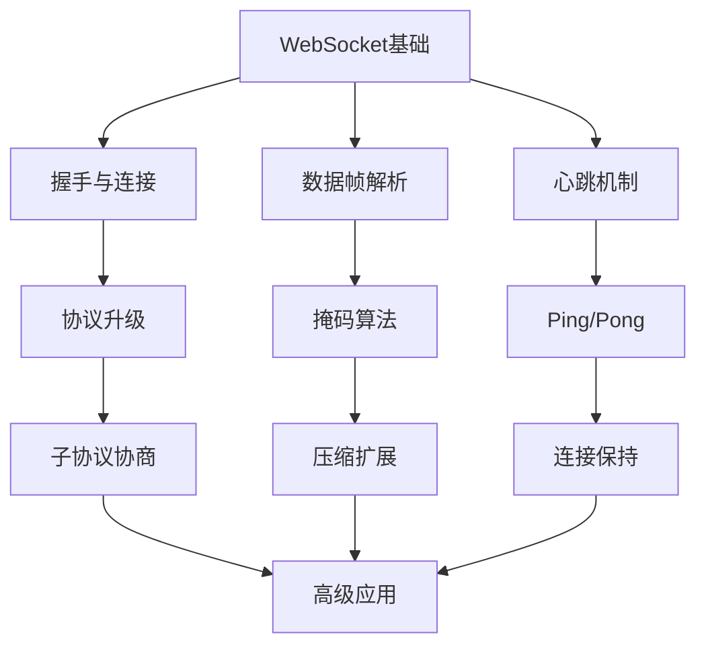
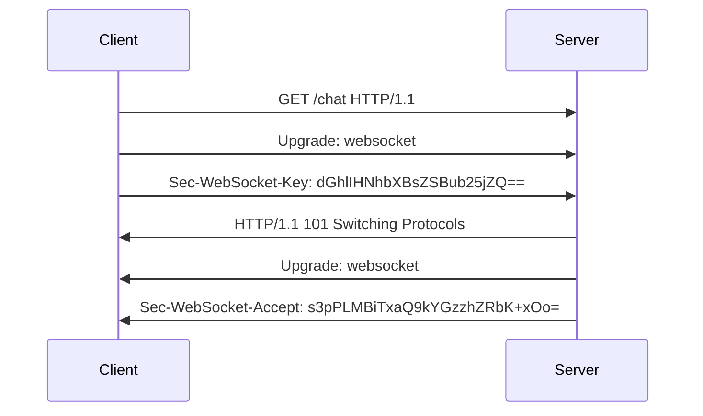
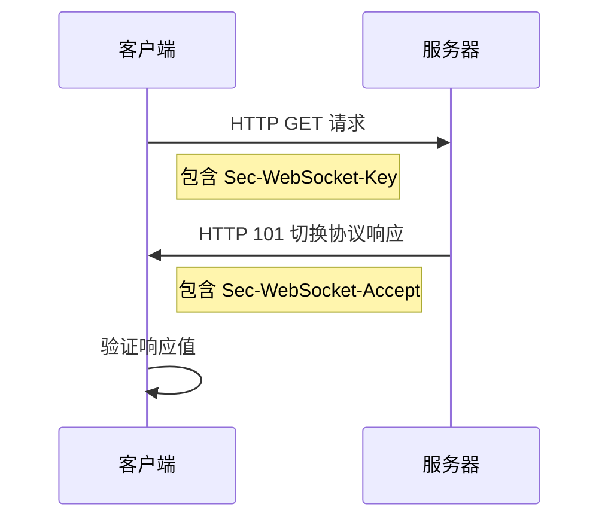
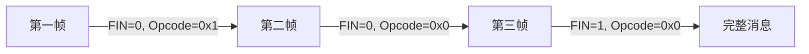
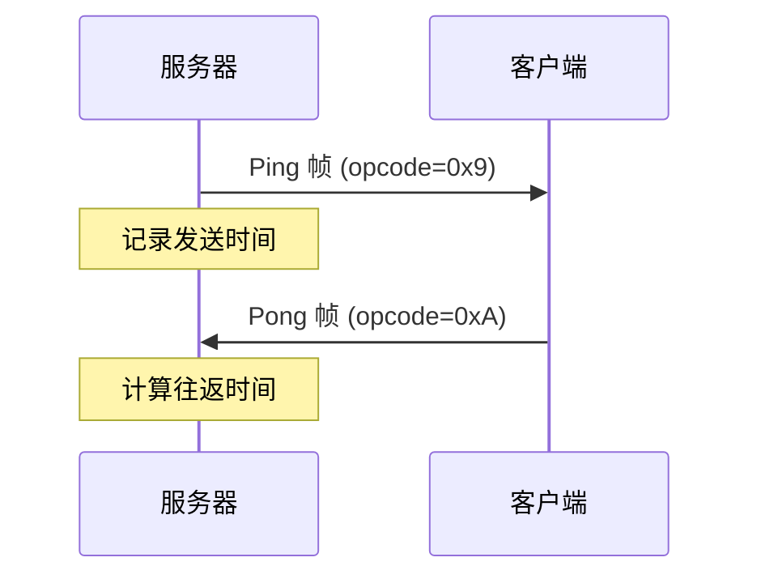
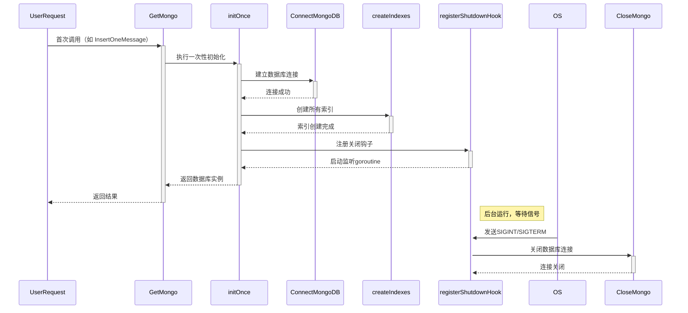

# GOIM


# Websocket原理





websocket是一种基于TCP的全双工通信协议，目的是为了解决HTTP协议只有在Client请求时才会从Server中回应的问题（即无法即时通信，在打游戏时Server端需要向Client端返回大量的敌人AI数据、服务器其他玩家数据等等）：

* HTTP协议是基于TCP的半双工通信，同一时刻Client和Server中只能有一个方向向对方传输数据
* HTTP是一种无状态的请求-响应型协议，每个请求都需要建立一个新的连接。服务器在每个响应之后会关闭连接，客户端需要重新建立发送新的请求
* HTTP支持持久连接，通过HTTP Keep-Alive头字段可以在一次连接中发送多个请求和响应
* 实现实时性的常用方法是轮询，但是效率较低，增加了一定量的网络负担

而**Websocket**协议：

* 全双工通信，客户端和服务器可以随时发送消息
* 基于单个TCP连接保持连接状态，避免每次通信都需要重新建立连接的开销
* 通过HTTP协议建立初始连接后Upgrade为Websocket协议（协议切换），可以由客户端或服务器发起关闭连接的请求
* 服务器或客户端可以通过事件触发实现及时的通信
* 适用于对实时性要求较高的应用，如online game or Instant Messaging

## 数据帧类型

```python
 0                   1                   2                   3
 0 1 2 3 4 5 6 7 8 9 0 1 2 3 4 5 6 7 8 9 0 1 2 3 4 5 6 7 8 9 0 1
+-+-+-+-+-------+-+-------------+-------------------------------+
|F|R|R|R| opcode|M| Payload len |    Extended payload length    |
|I|S|S|S|  (4)  |A|     (7)     |             (16/64)           |
|N|V|V|V|       |S|             |   (if payload len==126/127)   |
| |1|2|3|       |K|             |                               |
+-+-+-+-+-------+-+-------------+ - - - - - - - - - - - - - - - +
|     Extended payload length continued, if payload len == 127  |
+ - - - - - - - - - - - - - - - +-------------------------------+
|                               |Masking-key, if MASK set to 1  |
+-------------------------------+-------------------------------+
| Masking-key (continued)       |          Payload Data         |
+-------------------------------- - - - - - - - - - - - - - - - +
:                     Payload Data continued ...                :
+ - - - - - - - - - - - - - - - - - - - - - - - - - - - - - - - +
|                     Payload Data continued ...                |
+---------------------------------------------------------------+
```

* `FIN`: 是否为最终帧

* `RSV1-3`: 扩展操作码

* `opcode`: 操作码

  * 0x0: 连续帧。表示本次数据传输采用了数据分片，当前收到的数据帧是发送数据的其中一个数据分片
  * 0x1: 文本帧。使用文本格式表示数据
  * 0x2: 二进制帧。使用二进制表示数据
  * 0x8: 关闭连接
  * 0x9: Ping
  * 0xA: Pong

* `mask`:是否要对数据载荷进行掩码操作。当客户端向服务器端发送数据时，**必须**对数据进行掩码操作。服务器对客户端发送数据时不需要进行掩码操作。如果服务端接收到的客户端的数据没有进行过掩码操作，则会自动断开连接。

* `payload length`: 有效载荷的长度，单位是字节

  * **1.** **7位表示（0-125）：**

    如果payload的长度小于等于125，则payload长度字段使用7个比特（7位）直接表示

  * **2.** **16位表示（126）：**

    如果payload长度在126到65535之间，则payload长度字段使用126（二进制1111110）表示，后面跟着一个16位的无符号整数，用于表示实际的payload长度。

  * **3.** **64位表示（127）：**

    如果payload长度大于65535，则payload长度字段使用127（二进制1111111）表示，后面跟着一个64位的无符号整数，用于表示实际的payload长度

* `masking-key`: 加密或掩码数据载荷（payload）的密钥。0或4字节（因为`mask`为0时不需要进行掩码操作）

* `payload data`: 应用数据

## 握手与连接

在客户端与服务器建立持久连接之前，客户端通过http协议发送一个特殊请求，然后服务器通过http响应将协议升级为websocket，从而确立连接

1. 客户端发送握手请求。客户端（如浏览器）使用http协议发送一个特殊请求给服务器，该请求中包含一些特定的头部信息，如`Upgrade`和`Sec-WebSocket-Key`（16字节Base64编码随机字符串，用于服务器的验证）

```python
GET /chat HTTP/1.1
Host: server.example.com
Upgrade: websocket
Connection: Upgrade
Sec-WebSocket-Key: dGhlIHNhbXBsZSBub25jZQ==
Sec-WebSocket-Version: 13
```

2. 服务器发送握手响应。服务器同意建立websocket连接，发送一个http响应，响应中也包含一些特定的头部信息，如`Upgrade`（确认将协议升级为websocket）和`Sec-WebSocket--Accept`（根据客户端的`Sec-WebSocket-Key`计算出的验证码）

   1. 服务器计算响应值
      1. 拼接客户端密钥和GUID
      2. 计算SHA-1哈希值
      3. 对哈希结果进行64编码
   2. 服务器返回握手响应

   ```python
   HTTP/1.1 101 Switching Protocols
   Upgrade: websocket
   Connection: Upgrade
   Sec-WebSocket-Accept: s3pPLMBiTxaQ9kYGzzhZRbK+xOo=
   ```

   3. 客户端验证响应
      1. 客户端使用相同算法计算期望值
      2. 比较计算结果与服务器返回的`Sec-WebSocket--Accept`
      3. 匹配则建立websocket连接

```python
dGhlIHNhbXBsZSBub25jZQ==258EAFA5-E914-47DA-95CA-C5AB0DC85B11 # 拼接客户端密钥和GUID
```

握手成功后，客户端和服务器之间的连接就被升级为了WebSocket协议，之后双方可以通过该连接实现全双工通信



```python
import base64
import hashlib

def generate_accept(key: str) -> str:
    """计算Sec-WebSocket-Accept值"""
    GUID = "258EAFA5-E914-47DA-95CA-C5AB0DC85B11"
    combined = key.encode() + GUID.encode()
    sha1 = hashlib.sha1(combined).digest()
    return base64.b64encode(sha1).decode()

# 示例
client_key = "dGhlIHNhbXBsZSBub25jZQ=="
accept_key = generate_accept(client_key)
print(f"Sec-WebSocket-Accept: {accept_key}")  # 输出: s3pPLMBiTxaQ9kYGzzhZRbK+xOo=
```

GUID（全局唯一标识符）是一个[固定的魔法字符串](https://stackoverflow.com/questions/13456017/what-does-258eafa5-e914-47da-95ca-c5ab0dc85b11-means-in-websocket-protocol)：`"258EAFA5-E914-47DA-95CA-C5AB0DC85B11"`

1. **唯一性**：专门为 WebSocket 协议设计，确保不会与其他协议冲突
2. **固定值**：所有 WebSocket 实现必须使用这个相同的 GUID
3. **设计目的**：防止非 WebSocket 服务器意外接受连接
4. **长度**：36 个字符（32 个十六进制数字 + 4 个连字符）

## 数据帧解析

```python
                     0                   1                   2                   3
                     0 1 2 3 4 5 6 7 8 9 0 1 2 3 4 5 6 7 8 9 0 1 2 3 4 5 6 7 8 9 0 1
                    +-+-+-+-+-------+-+-------------+-------------------------------+
                    |F|R|R|R| opcode|M| Payload len |    Extended payload length    |
                    |I|S|S|S|  (4)  |A|     (7)     |             (16/64)           |
                    |N|V|V|V|       |S|             |   (if payload len==126/127)   |
                    | |1|2|3|       |K|             |                               |
                    +-+-+-+-+-------+-+-------------+ - - - - - - - - - - - - - - - +
                    |     Extended payload length continued, if payload len == 127  |
                    + - - - - - - - - - - - - - - - +-------------------------------+
                    |                               |Masking-key, if MASK set to 1  |
                    +-------------------------------+-------------------------------+
                    | Masking-key (continued)       |          Payload Data         |
                    +-------------------------------- - - - - - - - - - - - - - - - +
                    :                     Payload Data continued ...                :
                    + - - - - - - - - - - - - - - - - - - - - - - - - - - - - - - - +
                    |                     Payload Data continued ...                |
                    +---------------------------------------------------------------+
```

```python
import struct

def parse_frame(data: bytes):
    """解析WebSocket帧"""
    # 读取前两个字节
    byte1, byte2 = data[0], data[1]
    
    # 解析第一个字节
    fin = (byte1 & 0x80) >> 7
    opcode = byte1 & 0x0F
    
    # 解析第二个字节
    masked = (byte2 & 0x80) >> 7
    payload_len = byte2 & 0x7F
    
    # 处理扩展长度
    offset = 2
    if payload_len == 126:
        payload_len = struct.unpack('>H', data[offset:offset+2])[0]
        offset += 2
    elif payload_len == 127:
        payload_len = struct.unpack('>Q', data[offset:offset+8])[0]
        offset += 8
    
    # 读取掩码密钥
    mask_key = None
    if masked:
        mask_key = data[offset:offset+4]
        offset += 4
    
    # 读取有效载荷
    payload = data[offset:offset+payload_len]
    
    # 应用掩码
    if masked and mask_key:
        payload = apply_mask(payload, mask_key)
    
    return fin, opcode, payload

def apply_mask(payload: bytes, mask_key: bytes) -> bytes:
    """应用掩码到有效载荷"""
    unmasked = bytearray(payload)
    for i in range(len(unmasked)):
        unmasked[i] ^= mask_key[i % 4]
    return bytes(unmasked)
```

1. 使用`byte1=data[0]`解析第一个字节

   1. `fin = (byte1&0x80) >> 7 `取最高位作为FIN
   2. `RSV1-3`作为保留位用于协议扩展
   3. `opcode = byte1 & 0x0f`取低四位

2. 使用`byte2=data[1]`解析第二个字节

   1. `mask_bit = (byte2 & 0x80) >> 7`判断是否使用掩码
   2. 之后通过`byte2 & 0x7F`获取有效载荷长度。此时需要额外判断实际长度

   ```python
   offset = 2  # 当前读取位置
   
   if payload_len == 126:
       # 16位无符号整数
       payload_len = struct.unpack('>H', data[offset:offset+2])[0]
       offset += 2
   elif payload_len == 127:
       # 64位无符号整数
       payload_len = struct.unpack('>Q', data[offset:offset+8])[0]
       offset += 8
   ```

3. 判断是否需要存在`mask_bit`, 如果存在则需要读取掩码密钥（4位）

4. 读取有效载荷`payload = data[offset:offset+payload_len]`

5. 应用掩码

6. 根据`opcode`值，对特殊帧进行处理

```python
if opcode == 0x8:  # 关闭帧
    # 关闭帧可能包含关闭原因
    if len(payload) >= 2:
        close_code = struct.unpack('>H', payload[:2])[0]
        reason = payload[2:].decode('utf-8', 'ignore')
    else:
        close_code = 1005  # 无状态码
        reason = ""
        
elif opcode == 0x9:  # Ping帧
    # 需要响应Pong帧
    pong_frame = build_frame(payload, opcode=0xA)
    
elif opcode == 0xA:  # Pong帧
    # 心跳响应
    last_pong_time = time.time()
```



* `FIN=0，opcode=0x1`，表示发送的是文本类型，且消息还没发送完成，还有后续的数据帧。
* `FIN=0，opcode=0x0`，表示消息还没发送完成，还有后续的数据帧，当前的数据帧需要接在上一条数据帧之后。
* `FIN=1，opcode=0x0`，表示消息已经发送完成，没有后续的数据帧，当前的数据帧需要接在上一条数据帧之后。服务端可以将关联的数据帧组装成完整的消息。

## 心跳机制



1. **主动探测**：服务器定期发送 Ping 帧
2. **即时响应**：客户端收到 Ping 后必须回复 Pong
3. **超时检测**：服务器检测 Pong 响应时间
4. **连接保持**：防止中间设备（路由器、防火墙）断开空闲连接

## 为什么需要心跳机制？

1. **连接状态检测**：
   - 发现网络中断或客户端崩溃
   - 避免"半开连接"（Half-Open Connections）
2. **NAT/防火墙穿透**：
   - 保持连接活跃，防止 NAT 表项过期
   - 避免防火墙关闭空闲连接
3. **负载均衡健康检查**：
   - 向负载均衡器证明连接仍然活跃
4. **延迟测量**：
   - 计算网络往返时间（RTT）
5. **资源回收**：
   - 自动清理僵尸连接，释放服务器资源

## 协议规范（RFC 6455）

- **Ping 帧** (opcode=0x9)：
  - 可由任一端点发送
  - 必须包含应用数据（长度≤125字节）
- **Pong 帧** (opcode=0xA)：
  - 必须响应接收到的 Ping 帧
  - 应用数据必须与对应的 Ping 帧相同
- **自动响应规则**：
  - 端点收到 Ping 后必须立即回复 Pong
  - 不允许多个未响应 Ping 同时存在

# Mongodb工作原理

## Document Model

* 数据存储的基本单位是`document`，是一种类似JSON的数据结构(Binary JSON)
* 是灵活的键值对集合

## Collection

* 一组文档的容器。相当于关系型数据库的表
* **无模式**，同一个集合中的文档可以拥有不同的结构（字段）

## Database

* 多个集合Collection的逻辑分组
* 一个MongoDB实例可以托管多个数据库

## BSON

- MongoDB 在内部使用 BSON 来存储文档和通过网络传输数据
- BSON 是 JSON 的二进制编码形式，扩展了 JSON 的数据类型（如 Date, Binary Data, ObjectId 等），并且更高效地进行解析和遍历

## 分布式架构

- **副本集 (Replica Set):** MongoDB 实现高可用性的主要方式。
  - 一个副本集包含多个 MongoDB 实例（节点），通常包括：一个 **主节点** 和多个 **从节点**。
  - 主节点：处理所有的**写操作**。
  - 从节点：复制主节点的数据，可以处理**读操作**（提供读取扩展），并在主节点故障时自动选举出一个新的主节点（实现自动故障转移）。
- **分片 (Sharding):** MongoDB 实现水平扩展（处理海量数据和超高吞吐量）的方式。
  - 将单个大型集合的数据**水平拆分**，并分布到多个 MongoDB 实例（称为 **分片**）上。
  - 每个分片可以是一个独立的 MongoDB 实例，但**强烈建议**每个分片本身是一个副本集（保证分片内的高可用）。
  - **分片键 (Shard Key):** 选择一个或多个字段作为如何拆分数据的依据。MongoDB 根据分片键的值决定文档存储在哪个分片上。
  - **查询路由 (mongos):** 应用程序连接到一个特殊的进程 `mongos`（查询路由器）。`mongos` 知道数据分布在哪些分片上，并将查询和写操作路由到正确的分片（或多个分片）。应用程序通常只与 `mongos` 交互，无需直接连接底层分片。

## 索引Indexing

- 为了提高查询性能，MongoDB 支持在文档的字段上创建索引（如单字段索引、复合索引、多键索引、文本索引、地理空间索引等）
- 索引的工作原理类似于书的目录，允许数据库快速定位数据，避免全集合扫描

## 如何使用go mongo driver优雅的连接关闭mongodb



```go
package models

import (
	"context"
	"log"
	"os"
	"os/signal"
	"sync"
	"syscall"
	"time"

	"go.mongodb.org/mongo-driver/v2/bson"
	"go.mongodb.org/mongo-driver/v2/mongo"
	"go.mongodb.org/mongo-driver/v2/mongo/options"
)

var (
	Mongo        *mongo.Database
	mongoClient  *mongo.Client
	initOnce     sync.Once
	shutdownOnce sync.Once
)

func GetMongo() *mongo.Database {
	initOnce.Do(func() {
		ConnectMongoDB()
		createIndexes()
		registerShutdownHook()
	})
	return Mongo
}

// 初始化MongoDB连接
func ConnectMongoDB() {
	uri := "mongo://localhost:27017"
	clientOptions := options.Client().
		ApplyURI(uri).
		SetMaxPoolSize(100).
		SetMinPoolSize(10).
		SetConnectTimeout(10 * time.Second).
		SetServerSelectionTimeout(10 * time.Second)
	client, err := mongo.Connect(clientOptions)
	if err != nil {
		log.Fatalf("Fail to connect to mongodb: %v\n", err)
	}

	if err = client.Ping(context.Background(), nil); err != nil {
		log.Fatalf("Fail to ping mongodb: %v\n", err)
	}

	mongoClient = client
	Mongo = client.Database("GOIM")
	log.Println("Connect to mongodb successfully")
}

func registerShutdownHook() {
	c := make(chan os.Signal, 1)
	signal.Notify(c, os.Interrupt, syscall.SIGTERM)

	go func() {
		<-c
		shutdownOnce.Do(func() {
			log.Println("接收到关闭信号，正在断开mongodb连接")
			ctx, cancel := context.WithTimeout(
				context.Background(),
				5*time.Second,
			)
			defer cancel()
			if err := mongoClient.Disconnect(ctx); err != nil {
				log.Printf("关闭mongodb连接失败: %v", err)
			} else {
				log.Println("mongodb连接已关闭")
			}
		})
	}()
}

// 由main函数调用，关闭mongodb连接
func CloseMongo() {
	shutdownOnce.Do(func() {
		ctx, cancel := context.WithTimeout(
			context.Background(),
			5*time.Second,
		)
		defer cancel()
		if err := mongoClient.Disconnect(ctx); err != nil {
			log.Printf("关闭mongodb连接失败: %v", err)
		}
	})
}

func createIndexes() {
	log.Println("开始创建数据库索引...")
	createMessageIndexes()
	log.Println("数据库索引创建完成")
}

func createMessageIndexes() {
	collection := Mongo.Collection(Message{}.CollectionName())
	indexes := []mongo.IndexModel{
		{
			Keys: bson.D{
				{Key: "room_id", Value: 1},
				{Key: "created_at", Value: -1},
			},
			Options: options.Index().SetName("room_created_desc"),
		},
		{
			Keys: bson.D{
				{Key: "user_id", Value: 1},
				{Key: "created_at", Value: -1},
			},
			Options: options.Index().SetName("user_created_desc"),
		},
		{
			Keys: bson.D{
				{Key: "created_at", Value: -1},
			},
			Options: options.Index().SetName("created_at_desc"),
		},
	}

	_, err := collection.Indexes().CreateMany(context.Background(), indexes)
	if err != nil {
		log.Printf("消息索引创建失败: %v\n", err)
	} else {
		log.Println("消息索引创建成功")
	}
}
```

